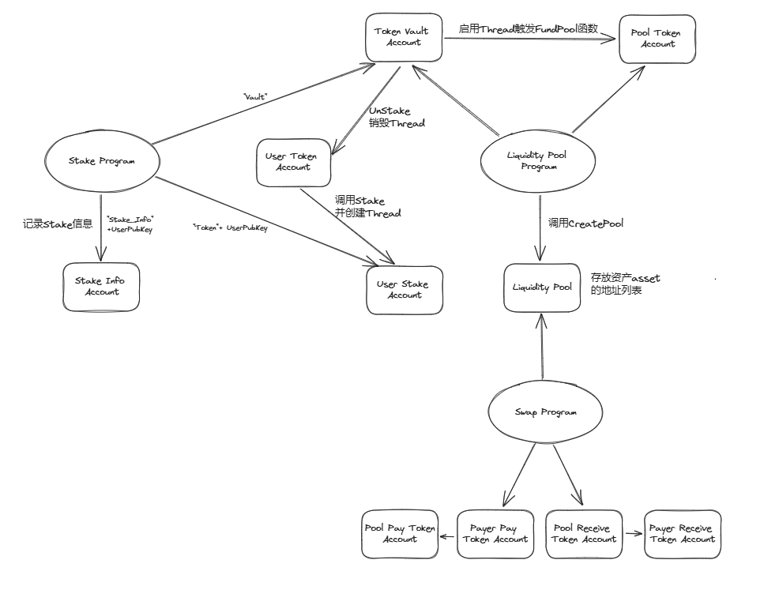

# PtSolProgram

- 发布代币合约并添加进流动性池子，可在DEX上交易
- 发布质押代币的合约，支持将代币质押的年化率定为5%

买卖收1%, 收集满供应量的1%就自动添加进流动性池子。

## 架构设计

整个程序涉及`tokens`、`staking`和`liq_pool`三个模块，使用到开源[Clockwork](https://github.com/open-clockwork/clockwork)做自动化资产转移：

- `tokens`模块：

    - `initToken`：初始化`Token`，创建`mint`账户和元数据账户
    - `mintTokens`：铸造一些`Token`，从`mint`账户转移到AT账户

- `staking`模块：

    - `initStaking`: 初始化关于`stake`的账户，包括`vault`账户用于存放`stake`奖励、`stakingInfo`账户用于记录`stake`信息和`stake`账户用于存放`Token`
    - `stake`：将`UserToken`账户中`Token`转移到`stake`账户，同时创建`Thread`，里面`Trigger`是按照需求标准计算出需要的slot，stake 需要跑过 $x$ 个slot:

    $$
    \begin{align*}
        \frac{\text{stake\_amount} \times 5\%}{365 \times 216,000 \text{ slot}} &= \frac{\text{pool\_total\_amount} \times 1\%}{x} \\
        x &= \frac{\text{pool\_total\_amount} \times 15,768,000 \text{ slot}}{\text{stake\_amount}}
    \end{align*}
    $$
    
    当达到触发条件时，`Thread`会调用`FundPool`将`vault_token_account`的`Token`转移到`pool_token_account`中
    - `unStake`：将`vault`账户和`stake`账户的`Token`转移到`UserToken`账户，同时`Thread`销毁

- `liq_pool`模块：

    - `createPool`：初始化流动性池子`pool`
    - `fundPool`: 从`payer_token_account`将`Token`转移至`pool_token_account`
    - `swap`: 定义了`payer_pay_token_account`将`Token`转移到`pool_pay_token_account`，同时将`pool_receive_token_account`中的`Token`转移到`payer_receive_token_account`。

## Swap计算模型

关于计算Swap则是采用了恒定乘积做市商模型 Constant Product Market Maker Model：

公式非常的简单：$x * y = K$ 。令交易的两虚拟货币为 $X$ 和 $Y$，各自数量为 $x$ 和 $y$，两货币数量的乘积 $x * y$ 恒等于 $K$，$K$ 值是由第一笔注入的流动性所决定。

因此，用 $∆x$ 数量的 $X$ 币来购买 $Y$ 币所能得到的数量 $∆y$、或是为了购买 $∆y$ 需要付出的 $∆x$ 数量，依照此公式进行计算：$(x+∆x)(y-∆y) = K$ ，而交易的价格就是两币量 $∆x$ 和 $∆y$ 的比。

以下公式用 $α = \frac{∆x}{x}$ 和 $β = \frac{∆y}{y}$ 来表示 $∆x$ 和 $∆y$ 及 $X$ $Y$ 两币在交易发生后的新均衡数量：

$$
\begin{align*}
x' &= x + ∆x = (1 + α)x = \frac{1}{1 - β}x\\
y' &= y + ∆y = \frac{1}{1 + α}y = (1 - β)y
\end{align*}
$$

通过转换得到，

$$
\begin{align*}
∆x &= \frac{β}{1 - β}x\\
∆y &= \frac{α}{1 + α}y
\end{align*}
$$

如果计入手续费，设 $\rho = 1\%$ 的手续费，$\gamma = 1-\rho$ ， 则

$$
\begin{align*}
∆x &= \frac{β}{(1 - β)\gamma} x\\
∆y &= \frac{α\gamma}{1 + α\gamma}y = \frac{∆x\gamma}{x + ∆x\gamma}y
\end{align*}
$$

